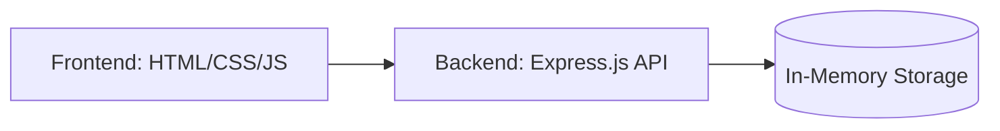

# ✦ TaskFlow — Modern To-Do List Application

A modern, full-stack To-Do List web application built with **HTML, CSS, JavaScript, Node.js, and Express**. 

> [!NOTE]
> This version uses **In-Memory Storage**. No database setup is required! Your tasks are stored in the server's memory and will reset when the server restarts.


---

## 📋 Features

- ✅ **Create** new tasks with ease
- 📝 **Edit** tasks inline instantly
- ✔️ **Mark habits** as complete/incomplete
- 🗑️ **Delete** tasks with smooth, animated transitions
- 🔍 **Real-time Filtering** — View All, Active, or Completed tasks
- 📊 **Dynamic Counter** tracking your remaining items
- 🐳 **Dockerized** — One-command deployment
- 🚀 **Zero Configuration** — Just clone and run

---

## 🏗️ Architecture



| Layer | Technology |
|-------|-----------|
| **Frontend** | HTML5, CSS3, Vanilla JavaScript |
| **Backend** | Node.js, Express.js |
| **Storage** | In-Memory Object Store (Session-based) |
| **Container** | Docker |

---

## 📁 Project Structure

```text
taskflow/
├── public/                  # Frontend static files
│   ├── index.html           # Main UI structure
│   ├── style.css            # Premium dark theme styles
│   └── app.js               # Client-side logic & API calls
├── routes/
│   └── tasks.js             # Express API routes (In-memory logic)
├── server.js                # Application entry point
├── Dockerfile               # Docker build configuration
├── docker-compose.yml       # Docker Compose orchestration
└── package.json             # Project dependencies
```

---

## 🚀 Quick Start

### 1. Clone the Repository
```bash
git clone https://github.com/Mahinth/Taskflow.git
cd Taskflow
```

### 2. Install Dependencies
```bash
npm install
```

### 3. Run the App
```bash
npm start
``` 
Open **http://localhost:3000** in your browser.

---

## 🐳 Running with Docker

TaskFlow is fully containerized. You can run it without even having Node.js installed on your machine.

### Build and Run locally:
```bash
docker build -t taskflow .
docker run -p 3000:3000 taskflow
```
Open browser and run in http://localhost:3000

### Using Docker Globally:

docker pull mahinth/taskflow:latest

docker run -d -p 3000:3000 --name taskflow mahinth/taskflow:latest

Open browser and run in http://localhost:3000


## 🤝 Contributing


1. **Branch** 
2. **Commit** 
3. **Push** 
4. **Open a Pull Request**

---


## 🙏 Acknowledgements

- [Express.js](https://expressjs.com/) — The fast, minimalist web framework
- [Docker](https://www.docker.com/) — For seamless containerization
- [Node.js](https://nodejs.org/) — The foundation of our backend
